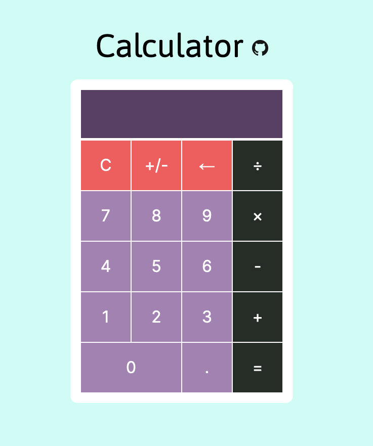

## Online Calculator

This project is an online calculator that can perform basic arithmetic operations (+, -, x, / with both positive and negative and floating point numbers) built with HTML, CSS, and vanilla JavaScript. It was a great learning opportunity as I had to refactor my code to handle edge cases and making sure that the basic functions of a calculation are performed correctly. For instance, a number cannot (1) have more than one decimal point or (2) lead with a zero (trailing zero's are fine). Also, if a number is negative, the negative sign should disappear with the first digit as the user clicks on the backspace button (i.e. a negative sign cannot hang alone). While the project was challenging, it is rewarding to see the finished product without giving up.

🔗 Try out the calculator [here](https://devkarenc.github.io/calculator/).

### Demo Screenshot

